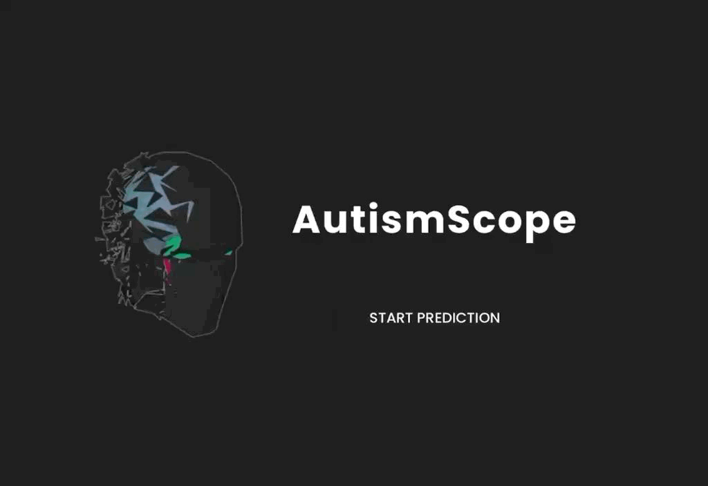

# Autism Predictor

A machine learning-based web application for predicting **Autism Spectrum Disorder (ASD)** using a **React frontend** and **Flask backend**.

<div align="center">
  <a href="https://shob0902.github.io/AutismScope/">
    
  </a>
</div>

---

## 🚀 Features

- **Interactive Web Interface** – Modern, responsive React frontend with glassmorphism design  
- **Machine Learning Prediction** – Flask backend with trained model for ASD prediction  
- **User-Friendly Form** – Comprehensive questionnaire covering A1–A10 scores and demographic data  
- **Real-time Results** – Instant prediction displayed to users  
- **Responsive Design** – Optimized for desktop, tablet, and mobile devices  
- **Visual Effects** – Custom cursor trail effects and animated background  

---

## 🏗 Project Structure

```bash
autism/
├── frontend/                # React frontend application
│   ├── public/
│   │   ├── index.html       # Main HTML file
│   │   └── manifest.json    # PWA manifest
│   ├── src/
│   │   ├── App.js           # Main React component
│   │   └── App.css          # Styling and responsive design
│   └── logo.png             # Custom logo
├── BOGV.gif                 # Background animation
├── package.json             # Frontend dependencies
├── backend/                 # Flask backend application
│   ├── app.py               # Main Flask application
│   ├── requirements.txt     # Python dependencies
│   ├── runtime.txt          # Python version specification
│   ├── Dockerfile           # Docker configuration
│   ├── best_model.pkl       # Trained ML model
│   └── encoders.pkl         # Label encoders
├── .gitignore
└── README.md                # This file
```

## 🛠 Technology Stack

### Frontend
- *React.js*: Modern JavaScript library for building user interfaces
- *CSS3*: Advanced styling with glassmorphism effects and responsive design
- *HTML5*: Semantic markup structure
- *Google Fonts*: Poppins font family for typography

### Backend
- *Flask*: Python web framework for API development
- *scikit-learn*: Machine learning library for model inference
- *pandas*: Data manipulation and processing
- *gunicorn*: WSGI server for production deployment
- *Flask-CORS*: Cross-origin resource sharing support

### Machine Learning
- *Trained Model*: Pre-trained classifier for ASD prediction
- *Label Encoders*: Categorical data encoding for model compatibility
- *Feature Engineering*: Comprehensive feature set including A1-A10 scores

## 📋 Prerequisites

Before running this application, ensure you have:

- *Node.js* (v14 or higher)
- *Python* (3.10 or higher)
- *npm* or *yarn* package manager
- *Git* for version control

## 🚀 Installation & Setup

### 1. Clone the Repository

bash
git clone <repository-url>
cd autism


### 2. Frontend Setup

bash
cd frontend
npm install
npm start


The frontend will be available at http://localhost:3000

### 3. Backend Setup

bash
cd backend
pip install -r requirements.txt
python app.py


The backend API will be available at http://127.0.0.1:5000

### 4. Verify Installation

- Frontend: Open http://localhost:3000 in your browser
- Backend Health Check: Visit http://127.0.0.1:5000/api/health

## 🎯 Usage

### For Users

1. *Landing Page*: Visit the application and click "START PREDICTION"
2. *Form Completion*: Fill out the comprehensive questionnaire including:
   - A1-A10 Score assessments (Yes/No options)
   - Demographic information (Age, Gender, Ethnicity)
   - Medical history (Jaundice, Family autism history)
   - Geographic and usage data (Country, App usage)
3. *Prediction*: Submit the form to receive instant ASD prediction results
4. *Results*: View the prediction outcome (ASD Positive/Negative)

### For Developers

#### Frontend Development

bash
cd frontend
npm start          # Start development server
npm run build      # Build for production
npm test           # Run tests


#### Backend Development

bash
cd backend
python app.py      # Start Flask development server


#### API Endpoints

- GET /api/health: Health check endpoint
- POST /predict: Main prediction endpoint
  - Accepts: multipart/form-data
  - Returns: JSON with prediction result

## 🎨 Design Features

### Visual Design
- *Glassmorphism*: Modern glass-like card effects
- *Responsive Layout*: Adapts to all screen sizes
- *Custom Animations*: Cursor trail effects and background GIF
- *Typography*: Clean Poppins font family
- *Color Scheme*: Dark theme with accent colors

### User Experience
- *Intuitive Navigation*: Clear landing page and form flow
- *Form Validation*: Comprehensive input validation
- *Loading States*: Visual feedback during prediction
- *Error Handling*: User-friendly error messages
- *Mobile Optimized*: Touch-friendly interface

## 🔧 Configuration

### Environment Variables

Create .env files in respective directories if needed:

*Frontend (.env)*

REACT_APP_API_URL=http://127.0.0.1:5000


*Backend (.env)*

FLASK_ENV=development
FLASK_DEBUG=True


### Model Files

Ensure the following files are present in the backend/ directory:
- best_model.pkl: Trained machine learning model
- encoders.pkl: Label encoders for categorical variables

## 🐳 Docker Deployment

### Backend Docker

bash
cd backend
docker build -t autism-backend .
docker run -p 5000:5000 autism-backend


### Frontend Docker

bash
cd frontend
docker build -t autism-frontend .
docker run -p 3000:3000 autism-frontend


## 🧪 Testing

### Frontend Testing

bash
cd frontend
npm test


### Backend Testing

bash
cd backend
python -m pytest


## 📊 Model Information

The application uses a pre-trained machine learning model that analyzes:

### Input Features
- *A1-A10 Scores*: Autism assessment questionnaire responses
- *Demographics*: Age, gender, ethnicity
- *Medical History*: Jaundice, family autism history
- *Geographic Data*: Country of residence
- *Usage Data*: Previous app usage

### Output
- *Binary Classification*: ASD Positive or ASD Negative
- *Confidence*: Model prediction confidence score

## 🤝 Contributing

1. Fork the repository
2. Create a feature branch (git checkout -b feature/amazing-feature)
3. Commit your changes (git commit -m 'Add amazing feature')
4. Push to the branch (git push origin feature/amazing-feature)
5. Open a Pull Request

## 📝 License

This project is licensed under the MIT License - see the [LICENSE](LICENSE) file for details.

## 🆘 Support

For support and questions:
- Create an issue in the repository
- Contact the development team
- Check the documentation for common issues

## 🔄 Version History

- *v1.0.0*: Initial release with React frontend and Flask backend
- *v1.1.0*: Added responsive design and mobile optimization
- *v1.2.0*: Implemented glassmorphism design and visual effects
- *v1.3.0*: Enhanced form validation and error handling


*Note*: This application is for educational and research purposes. Medical decisions should not be based solely on this tool. Always consult with healthcare professionals for proper diagnosis and treatment.
